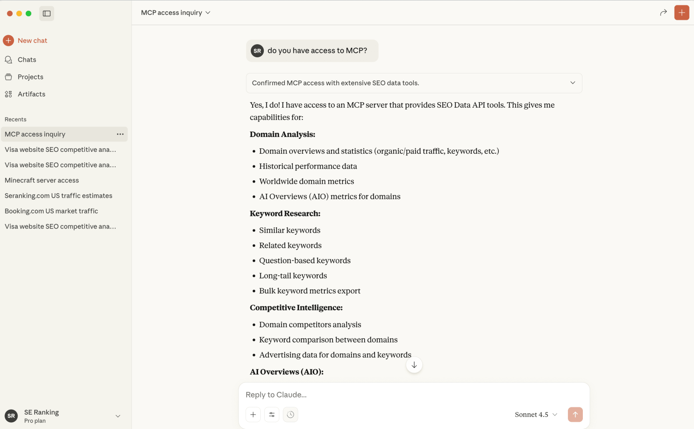
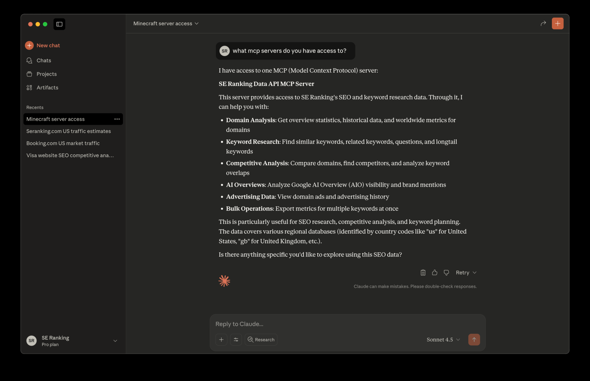
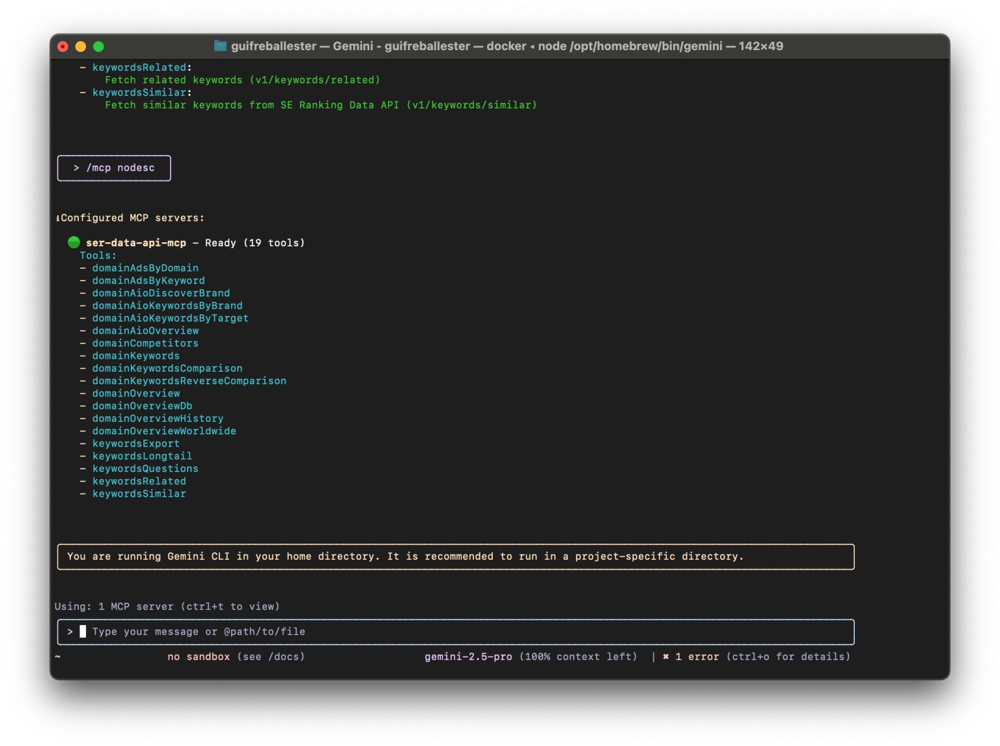

# MCP Server

## Installation

### Prerequisites

Before you begin, please ensure you have the following software and accounts ready:

- **SE Ranking Account**: You will need an active SE Ranking account to generate an API token. If you don’t have one, you can [sign up here](https://online.seranking.com/admin.api.dashboard.html).
- **Docker**: A platform for developing, shipping, and running applications in containers. If you don’t have it, you can [download it from the official Docker website](https://www.docker.com/get-started).
- **Docker Compose Plugin**: The Docker Compose plugin is a Docker CLI plugin that provides a command-line interface (CLI) for Docker Compose. To build the Docker image, you need to have [Docker Compose installed](https://docs.docker.com/compose/install/).
- **Git**: A free and open-source distributed version control system. You can download it from the official Git website.
- **AI Assistant**: You will need either the [Claude Desktop App](https://www.anthropic.com/claude) or the [Gemini CLI](https://github.com/google-gemini/gemini-cli) installed and configured on your machine.

### Installation Steps

Follow these steps to install the SEO-MCP server on your local machine.

- Open your terminal (or Command Prompt/PowerShell on Windows).
- Clone the project repository from GitHub. This command downloads the necessary files to your machine.

```shell
git clone https://github.com/seranking/seo-data-api-mcp-server.git
```

- Navigate into the new directory in your terminal:

```shell
cd seo-data-api-mcp-server
```

### Build the Docker Image

Make sure you're in the `seo-data-api-mcp-server` repository directory, and run:

```bash
docker compose build
# Check that the image is built and named `se-ranking/seo-data-api-mcp-server`:
docker image ls
```

Note: don't worry about the warnings, this is normal when building the image:

```
WARN[0000] The "SERANKING_API_TOKEN" variable is not set. Defaulting to a blank string.
```

#### How to Update SEO-MCP

To ensure you have the latest features and improvements, you should update the tool periodically.

- Navigate to your `seo-data-api-mcp-server` directory in the terminal.
- Pull the latest changes from the GitHub repository.

```shell
git pull origin main
```

## Connect to Claude Desktop

Claude Desktop reads its configuration from `claude_desktop_config.json`.

- Click on the Claude menu and select **Settings...**.
- In the Settings window, navigate to the **Developer** tab in the left sidebar.
- Click the **Edit Config** button to open the configuration file. This action creates a new configuration file if one doesn’t exist or opens your existing configuration.

The file is located at:

- macOS: `~/Library/Application\ Support/Claude/claude_desktop_config.json`
- Windows: `%AppData%\Claude\claude_desktop_config.json`
- Linux: `~/.config/Claude/claude_desktop_config.json`

Example of **Claude Desktop** configuration for MCP server

<b>JSON Configuration Template</b>:

```json
{
  "mcpServers": {
    "seo-data-api-mcp": {
      "command": "docker",
      "args": [
        "run",
        "-i",
        "--rm",
        "-e",
        "SERANKING_API_TOKEN",
        "se-ranking/seo-data-api-mcp-server"
      ],
      "env": {
        "SERANKING_API_TOKEN": "<your-api-token-here>"
      }
    }
  }
}
```

- You need to change the **SERANKING_API_TOKEN**, get yours from https://online.seranking.com/admin.api.dashboard.html

- After saving **claude_desktop_config.json**, restart Claude Desktop. You should see the server under MCP Servers/Tools.

- To verify the setup, ask Claude: `Do you have access to MCP?` It should respond by listing `seo-data-api-mcp`.



- Your setup is complete! You can now run complex SEO queries using natural language.



## Connect to Gemini CLI

- Open the Gemini CLI settings file, which is typically located at: `~/.gemini/settings.json`
- Add the following JSON configuration, making sure to **replace the SERANKING_API_TOKEN placeholder value.**

```json
{
  "mcpServers": {
    "seo-data-api-mcp": {
      "command": "docker",
      "args": [
        "run",
        "-i",
        "--rm",
        "-e",
        "SERANKING_API_TOKEN",
        "se-ranking/seo-data-api-mcp-server"
      ],
      "env": {
        "SERANKING_API_TOKEN": "<your-api-token-here>"
      }
    }
  }
}
```

`"SERANKING_API_TOKEN"`: Use your personal API token, which you can generate from the [SE Ranking API Dashboard](https://online.seranking.com/admin.api.dashboard.html).

- Save the configuration file.

- To verify the setup, launch the **Gemini CLI** by running `gemini` in your terminal. Once the interface is active, press `Ctrl+T` to view the available MCP servers. Ensure seo-data-api-mcp is listed.



- Your setup is complete! You can now run complex SEO queries using natural language.


## Available Tools

| Module | Tool Name | Description |
| :--- | :--- | :--- |
| SERP | `addSerpTasks` | Adds one or more search queries to the queue for SERP analysis. Note that SERP tasks usually take 60 seconds to finish. |
| SERP | `getSerpLocations` | Retrieves a list of available locations for SERP analysis. |
| SERP | `getSerpTaskAdvancedResults` | Retrieves the status or advanced results of a specific SERP task. Note that SERP tasks usually take 60 seconds to finish. If the task is still running, returns {"status": "processing"}. If complete, returns the full JSON results including "items". |
| SERP | `getSerpTaskResults` | Retrieves the status or standard results of a specific SERP task. Note that SERP tasks usually take 60 seconds to finish. If the task is still running, returns {"status": "processing"}. If complete, returns the full JSON results including "items". This endpoint provides results for the following SERP item types only: organic, ads, and featured_snippet. |
| SERP | `getSerpTasks` | Retrieves a list of all SERP tasks added to the queue in the last 24 hours. |
| ai search | `getAiOverview` | Retrieves a high-level overview of a domain's performance in AI search engines. Returns aggregated data if no engine is specified, or engine-specific data if an engine is provided. |
| ai search | `getAiPromptsByBrand` | Retrieves a list of prompts where the specified brand is mentioned in AI search results. |
| ai search | `getAiPromptsByTarget` | Retrieves a list of prompts (queries) that mention the specified target in AI search results. |
| backlinks | `exportBacklinksData` | Retrieves large-scale backlinks asynchronously, returning a task ID to check status later. |
| backlinks | `getAllBacklinks` | Retrieves a comprehensive list of backlinks for the specified target, with extensive filtering and sorting options. |
| backlinks | `getBacklinksAnchors` | Retrieves a list of anchor texts for backlinks pointing to the specified target, with sorting and limit options. |
| backlinks | `getBacklinksAuthority` | Fetch authority metrics for a target (domain, host or URL) (v1/backlinks/authority) |
| backlinks | `getBacklinksIndexedPages` | Fetch site pages that have backlinks, with sorting and limit controls (v1/backlinks/indexed-pages) |
| backlinks | `getBacklinksRefDomains` | Retrieves a list of referring domains pointing to the specified target, with options for sorting and limiting results. |
| backlinks | `getBacklinksSummary` | Retrieves a summary of backlink metrics for one or multiple targets (domains, subdomains, or URLs). |
| backlinks | `getCumulativeBacklinksHistory` | Returns a number of live backlinks for every day within the specified date range for the specified target. |
| backlinks | `getDistributionOfDomainAuthority` | Returns information about the distribution of Domain InLink Rank (Domain Authority) of all the domains that reference a specific target. |
| backlinks | `getNewLostRefDomainsCount` | Returns the number of referring domains, at least one backlink from which was newly found or lost in the specified date range, broken down by day. |
| backlinks | `getPageAuthority` | Returns information about the InLink Rank (Page Authority) for a target URL. |
| backlinks | `getPageAuthorityHistory` | Returns information about the historical values of InLink Rank for a specific target page. |
| backlinks | `getReferringIps` | Returns information about IPv4 addresses that belong to backlinks that point to a target. |
| backlinks | `getReferringIpsCount` | Returns the number of unique IPs linking to a target. |
| backlinks | `getReferringSubnetsCount` | Returns the number of unique subnets/C-blocks linking to a target. |
| backlinks | `listNewLostReferringDomains` | Returns a list of referring domains, at least one backlink from which was (newly) found or lost in the specified date range for the specified target. |
| domain analysis | `getDomainAdsByDomain` | Retrieves paid ads for a specific domain. |
| domain analysis | `getDomainAuthority` | Returns information about the domain InLink Rank (Domain Authority) of the target page’s root domain. |
| domain analysis | `getDomainCompetitors` | Retrieves a list of organic or paid competitors for a domain. |
| domain analysis | `getDomainKeywords` | Retrieves a list of keywords for which a domain ranks in organic or paid search. |
| domain analysis | `getDomainKeywordsComparison` | Analyzes and compares the keyword rankings of two websites: `domain` and `compare`. It can find keywords they have in common (`diff=0`) or identify a 'keyword gap' (`diff=1`)—keywords for which the `domain` ranks, but the `compare` domain does not. To find keywords the `compare` domain has but `domain` misses, swap the values of `domain` and `compare`. |
| domain analysis | `getDomainOverviewDatabases` | Fetch domain overview by database (v1/domain/overview/db) |
| domain analysis | `getDomainOverviewHistory` | Retrieves historical data for domain traffic and keyword rankings. |
| domain analysis | `getDomainOverviewWorldwide` | Retrieves an aggregated worldwide overview of domain metrics. |
| keyword research | `exportKeywords` | Retrieves metrics for a bulk list of keywords. |
| keyword research | `getDomainAdsByKeyword` | Retrieves paid ads for a specific keyword. |
| keyword research | `getKeywordQuestions` | Retrieves a list of question-based keywords containing the seed keyword. |
| keyword research | `getLongTailKeywords` | Retrieves a list of long-tail variations for the seed keyword. |
| keyword research | `getRelatedKeywords` | Retrieves a list of keywords semantically related to the seed keyword. |
| keyword research | `getSimilarKeywords` | Retrieves a list of keywords similar to the seed keyword. |
| website audit | `createAdvancedAudit` | Launches an advanced website audit that renders JavaScript before analyzing the page. Suitable for Single-Page Applications (SPAs) or dynamic content. |
| website audit | `createStandardAudit` | Launches a standard website audit that crawls the HTML of a website. Suitable for most static and server-side rendered sites. |
| website audit | `deleteAudit` | Permanently deletes a specified website audit report and all of its associated data. |
| website audit | `getAuditHistory` | Retrieves a historical snapshot of a specific audit run, providing the full context of that audit. |
| website audit | `getAuditPagesByIssue` | Retrieves a paginated list of all URLs affected by a specific issue within a given audit. |
| website audit | `getAuditReport` | Retrieves the full, detailed report for a completed website audit. Includes health score, domain properties, and broken down checks. |
| website audit | `getAuditStatus` | Checks the real-time status of a specific website audit, whether it’s queued, currently processing, or already finished. |
| website audit | `getCrawledPages` | Returns a paginated list of all URLs found during an audit, providing a complete sitemap as discovered by the crawler. |
| website audit | `getFoundLinks` | Returns a paginated list of every hyperlink discovered across the entire site during the audit. |
| website audit | `getIssuesByUrl` | Retrieves a detailed list of all issues (errors, warnings, and notices) that were found on a single, specific page within an audit. |
| website audit | `listAudits` | Retrieves a list of all website audits associated with your account, providing key details and statistics for each. |
| website audit | `recheckAudit` | Launches a new crawl of a previously completed audit, using the same settings. |
| website audit | `updateAuditTitle` | Changes the title of an existing website audit report. |

## Run as HTTP Server (Node)

In order to run the local Node server, you need to have [Node.js 20+](https://nodejs.org/en/download) version installed on your machine.

Run the following commands in your terminal:

```shell
npm install
```

To build the project, use the following command:

```shell
npm run build
```

To start the server use the command:

```shell
npm run start-http
```

Then your HTTP server should be running at: http://0.0.0.0:5000/mcp.

In case you'd like to modify the `HOST` and `PORT`, you can do so by creating a `.env` file in the root directory of the project with the settings you want to override, for example:

```shell
HOST=127.0.0.1
PORT=5555
```

Additionally, when you're running the server in the external environments/tools like [Replit](https://replit.com/) and similar, you can set the `SERANKING_API_TOKEN` environment variable in the configuration panel, and the application will use it when you start the server.

Note: If you change the `SERANKING_API_TOKEN` value when the server is running, you need to restart the server.

## Usage Example: Finding Keyword Opportunities

With the configuration complete, you can now use natural language prompts to interact with your SE Ranking data. Here is an example prompt to identify low-hanging keyword opportunities for a domain.

Copy and paste the following into your configured AI assistant:

```
Use the seo-mcp to identify the Keywords my domain is overlooking and find low-hanging fruit opportunities.
1. Analyze my domain's keyword performance:
   - Find keywords my domain has lost (not ranking) using the tool for getDomainKeywords with pos_change=lost.
   - Find keywords where my domain's position has gone down using the tool for getDomainKeywords with pos_change=down.
2. Conduct a competitive analysis:
   - Identify my top 2 competitors by finding all competitors with the tool for getDomainCompetitors and ordering them by common_keywords DESC.
   - Find 30 keywords that these competitors are ranking for but my domain is not. Use the getDomainKeywordsComparison tool with diff=1, order_field=volume, and order_type=DESC.
3. Identify new keyword opportunities:
   - For 10 of the competitor keywords found in the previous step, use the tools for getRelatedKeywords and getSimilarKeywords to find the top 5 related and similar keywords for each, ordered by volume DESC.
4. Synthesize and Report:
   - Create a final report of the findings. In the report, highlight potential low-hanging fruit from the new keyword opportunities by analyzing their CPC and keyword difficulty.
Domain to review: seranking.com
Market: us
```

### What This Prompt Does

This prompt instructs the model to perform a comprehensive competitive analysis by:

- **Finding Lost & Declining Keywords**: It first identifies keywords for seranking.com that have either been lost from the rankings or have dropped in position.
- **Identifying Top Competitors**: It finds all organic competitors and sorts them to identify the top two based on the number of shared keywords.
- **Uncovering Competitor-Ranked Keywords**: It compares seranking.com against its top competitors to find 30 high-volume keywords that they rank for, but seranking.com does not.
- **Generating a Final Report**: Finally, it synthesizes all of this information into a concise report, highlighting the most promising opportunities for growth.

To send the sample test request, which will verify if your server runs properly and has the correct setup,
**open another terminal window**, and run the following command **with your SE Ranking API token provided** as an argument:

```shell
./test-http-server-curl-request.sh '<your-api-token-here>'
```

For batch MCP Requests testing, you can use this script:

```shell
./test-batch-http-server-curl-request.sh '<your-api-token-here>'
```

## Troubleshooting

### Docker image problems

If you’re having trouble getting the MCP server to connect, here are a few steps to diagnose the issue.

Verifying if the Docker container is running when you run your AI Assistant (Claude or Gemini). If you start a chat with an AI, and your MCP Server is set up properly via JSON config, it should automatically start the Docker container.

To check if it’s running, open your terminal and run:

```shell
docker ps
```

If it’s working correctly, you will see an output similar to this:

```shell
CONTAINER ID   IMAGE                                    COMMAND                  CREATED          STATUS          PORTS     NAMES
de4e410ef0fd   se-ranking/seo-data-api-mcp-server       "docker-entrypoint.s…"   9 seconds ago    Up 8 seconds              musing_bhabha
```

This confirms that your AI assistant has successfully started the container, and it’s listening for connections.

If `docker ps` shows no running containers related to the MCP server, it usually points to a configuration issue:

- Incorrect/invalid JSON: Double-check the **claude_desktop_config.json** or **settings.json** for any syntax errors like missing commas or brackets. You can validate the JSON here: https://jsonlint.com/.

- Incorrect image name: Double-check the **claude_desktop_config.json** or **settings.json** for the correct image name `se-ranking/seo-data-api-mcp-server`

### Docker image running, but MCP server is not visible in Claude Desktop / Gemini CLI

If the docker image is running, but the MCP server is not visible in Claude Desktop, you can investigate the container by:

```
docker inspect <container-id>
```

For the following example, the container ID is `de4e410ef0fd`:

```shell
CONTAINER ID   IMAGE                                    COMMAND                  CREATED          STATUS          PORTS     NAMES
de4e410ef0fd   se-ranking/seo-data-api-mcp-server       "docker-entrypoint.s…"   9 seconds ago    Up 8 seconds              musing_bhabha
```

Note: you can shorten the container ID in case no other containers share that prefix, ex. `docker inspect de4`. When you're running multiple AI chats and/or tools connected to the MCP Servers, there can be multiple containers running, but all with the same IMAGE name.

This will show you the big JSON output, where particularly important is the "Config" section, ex.:

```json
{
  "Config": {
    "Hostname": "0977c3dc06fb",
    "Domainname": "",
    "User": "",
    "AttachStdin": true,
    "AttachStdout": true,
    "AttachStderr": true,
    "Tty": false,
    "OpenStdin": true,
    "StdinOnce": true,
    "Env": [
      "SERANKING_API_TOKEN=8abcdef-6fdd-a981-3ad5-123456",
      "PATH=/usr/local/sbin:/usr/local/bin:/usr/sbin:/usr/bin:/sbin:/bin",
      "NODE_VERSION=20.19.5",
      "YARN_VERSION=1.22.22",
      "NODE_ENV=production"
    ]
  }
}
```

Which shows you if you have the correct environment variables set.

## Support

SE Ranking API documentation: https://seranking.com/api/integrations/mcp/.

In case you have any questions or need help, please contact us at [api@seranking.com](mailto:api@seranking.com)
